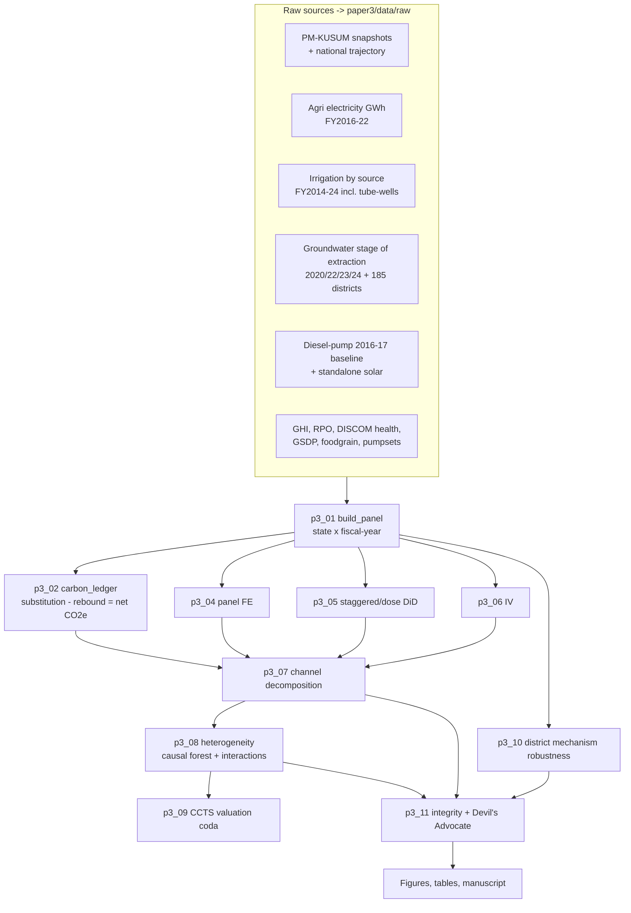
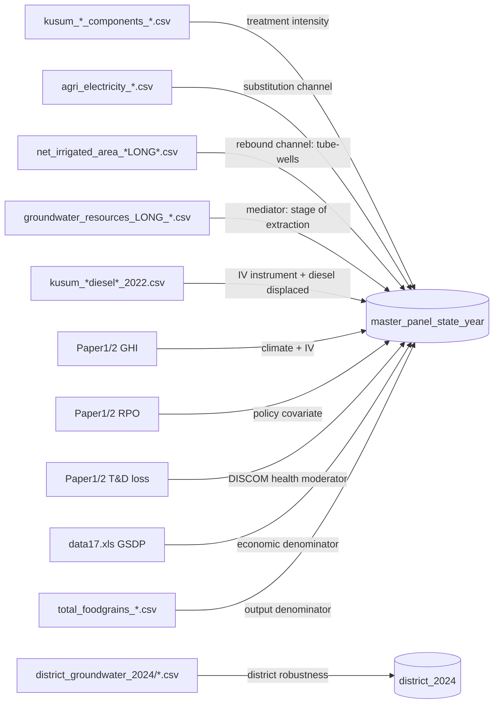

# Paper 3 — Analysis Plan, Data Dictionary & Reproducible Pipeline Spec
### *The Solar Irrigation Paradox* — state panel + district robustness, in Python

**Read me first.** This document is the complete, self-contained brief for the Factory droid (and any
collaborator). It specifies (1) a fresh, re-runnable project folder, (2) exactly what every data file
contains, (3) how they merge, and (4) the full analysis — with the hard rule that **nothing is
hardcoded on assumption**: every hyperparameter is chosen by cross-validated grid search, and every
non-tuned modelling choice is justified by cited methodological literature and stress-tested with
sensitivity analysis. Slower is fine. Defensible is the goal.

Workflow philosophy (academic-research-skills repo): **build → verify integrity → adversarial
self-review (Devil's Advocate) → revise → finalise.**

---

## 0. GOVERNING METHODOLOGICAL PRINCIPLES  *(apply to every stage)*

These are non-negotiable and override convenience at every step.

1. **No assumed hyperparameters.** Every tunable parameter (ML nuisance models, causal-forest depth/leaf
   size, penalty strengths, number of trees, lag length, bandwidth, threshold cut-offs) is selected by
   **cross-validated grid search** over a pre-registered grid. The chosen value, the grid searched, and
   the selection metric are logged to `outputs/paper3/reports/tuning_log.json`. No "I picked 1000 trees
   because it's common."
2. **No assumed feature engineering.** Candidate transformations (level vs log vs per-capita vs
   per-hectare; lag 0/1/2; interactions) are enumerated *a priori*, then selected by **information
   criteria (AIC/BIC), cross-validated predictive fit, and specification tests (Ramsey RESET,
   link tests)** — not by eyeballing. The candidate set and the winning spec are logged.
3. **Literature-backed defaults only.** Any choice that is *not* data-tuned (e.g., diesel emission
   factor, the DiD estimator family, clustering scheme) must cite a specific reference (see §13). If no
   citation exists, it becomes a sensitivity parameter instead.
4. **Sensitivity over assumption.** Anything that *could* be assumed (emission factor, treatment
   threshold, interpolation rule, functional form) is instead **swept across a grid of reasonable
   values**, and results are reported as a band, not a point. If the sign of a headline result flips
   within the band, we say so.
5. **Pre-registered decision rules.** Where two methods compete (causal forest vs interaction model),
   the rule for which becomes "primary" is written down *before* seeing results (see §8, Stage D6).
6. **Reproducibility.** Fixed global seed (`SEED = 1502`), pinned package versions, `run_all.py` that
   regenerates every number, table, and figure from raw inputs in one command. No manual steps.
7. **Integrity.** Every figure in the manuscript traces to a results table; every results table traces
   to a script; every input number traces to a source file cell. Verified in Stage F.

---

## 1. VISUAL SUMMARY

A standalone graphic is saved at `paper3/VISUAL_SUMMARY.svg` (open in any browser). The same logic in
text-renderable Mermaid is below so it travels with this file.

### 1a. End-to-end pipeline


### 1b. Which file feeds which variable


---

## 2. NEW SELF-CONTAINED PROJECT FOLDER  `paper3/`

Create a brand-new folder at the project root, **separate** from the manuscript folder `papers/paper3/`.
It holds all code, ingested raw copies, processed data, and outputs, so the whole study re-runs from one
command. `scripts/p3_00_setup.py` builds this tree and copies the source CSVs in (idempotent — safe to
re-run).

```
paper3/
├── data/
│   ├── raw/            # copies of every source CSV (ingested by p3_00) — never edited
│   └── processed/      # generated: master_panel_state_year.parquet, ledger, district_2024
├── config/
│   ├── state_map.json          # canonical state-name crosswalk (single source of truth)
│   ├── param_grids.json        # all grid-search ranges (so nothing is hardcoded in scripts)
│   ├── literature_defaults.json# cited constants (EFs, thresholds) + their reference key
│   └── viz_style.py            # the publication figure style (see §12)
├── scripts/           # p3_00 ... p3_11 (run in order)
├── outputs/paper3/
│   ├── figures/        # 300-dpi PNG + vector PDF/SVG
│   ├── tables/         # CSV + LaTeX
│   └── reports/        # tuning_log.json, integrity_report.md, devils_advocate.md
├── requirements.txt   # pinned versions
├── run_all.py         # runs p3_00 -> p3_11 end-to-end
└── README.md          # quickstart + this plan's summary
```

`requirements.txt` (pinned at run time): `pandas numpy scipy matplotlib seaborn pyfixest linearmodels
econml scikit-learn statsmodels differences pyarrow joblib`.

---

## 3. DATA DICTIONARY — what each file contains

### 3a. Built Paper-3 files — currently in `data/paper 3 data/kusum_extracted/` (p3_00 copies to `paper3/data/raw/`)

| File | Granularity | Coverage | Key columns | Role |
|---|---|---|---|---|
| `kusum_national_physical_progress_2019-20_to_2024-25.csv` | National × year | FY2019-20→2024-25 | year, componentA_MW, componentB_pumps, componentC_pumps | Treatment timing (national trajectory) |
| `kusum_statewise_progress_components_as30Jun2025.csv` | State (cumulative) | as on 30.06.2025 | state, compA/B/C sanctioned & installed | **Treatment intensity (latest)** |
| `kusum_statewise_solarpumps_sanctioned_installed_as31Dec2024.csv` | State (cumulative) | as on 31.12.2024 | state, compA/B/C sanctioned & installed | Treatment intensity (earlier) |
| `kusum_statewise_diesel_vs_standalonesolar_pumps_as31Oct2022.csv` | State | AISI 2016-17 + 2022 | state, diesel_pumps_AISI_2016_17, standalone_solar_pumps_installed | **IV instrument** + diesel displaced |
| `kusum_statewise_CO2_emission_reduction_as31Oct2022.csv` | State | as on 31.10.2022 | state, co2_reduction_000tonnes_per_annum | **Ledger validation benchmark** |
| `agri_electricity_consumption_GWh_2016-17_to_2019-20.csv` | State × year | FY2016-17→2019-20 | state, agri_GWh_*, total_GWh_* | **Substitution channel** |
| `agri_electricity_consumption_GWh_2020-21_to_2021-22.csv` | State × year | FY2020-21,21-22 | state, agri_GWh_*, total_GWh_*, agri_share_pct_* | Substitution channel (recent) |
| `net_irrigated_area_by_source_000ha_LONG_2014-15_to_2023-24.csv` | State × year (LONG) | FY2014-15→2023-24 | state, fy, canal_total, tanks, **tubewells**, other_wells, other_sources, net_irrigated_000ha | **Rebound channel** |
| `net_irrigated_area_by_source_000ha_2023-24.csv` | State | FY2023-24 | — | **SUPERSEDED — ignore** |
| `groundwater_resources_LONG_2020_2022_2023_2024.csv` | State × assessment-year | 2020,2022,2023,2024 | state, assessment_year, extractable_bcm, extraction_irrigation_bcm, extraction_total_bcm, **stage_of_extraction_pct** | **Mediator** |
| `irrigation_pumpsets_energised_statewise_as31Mar2023.csv` | State | as on 31.03.2023 | state, pumpsets_total_31Mar2023, agri_energy_GWh, agri_connected_load_kW, avg_capacity_per_pumpset_kW | Covariate (electric pump stock) |
| `total_foodgrains_area_production_productivity_2024-25.csv` | State | FY2024-25 | state, area_total_lakh_ha, production_total_lakh_tonne, productivity_total_kg_per_ha | **Output denominator** |
| `_MANIFEST_and_sources.md` | — | — | — | Provenance / source IDs |

### 3b. Open-source files — `data/paper 3 data/opensource_extracted/`

| File | Granularity | Coverage | Role |
|---|---|---|---|
| `CGWB_groundwater_statewise_2024_opencity_OPENSOURCE.csv` | State | 2024 | Open, citable; **integrity cross-check** (matches our Indiastat groundwater exactly) |
| `district_groundwater_2024/{Goa,Delhi,Gujarat,Telangana,Karnataka,Maharashtra,TamilNadu}_district_groundwater_2024.csv` | **District** (~185 units) | 2024 | **District robustness** — incl. `Stage of GW extraction (%)` |
| `opensource_reference_values.md` | — | — | CEA grid EF (Combined Margin **0.7383 tCO₂/MWh**, FY2024-25) + CGWB national + Dataful note |

### 3c. Inherited Paper 1/2 variables — `data/processed/`, `data/raw_open/` (confirm filenames via `PROJECT_OVERVIEW.md`)
RE capacity, RE generation by source, **GHI irradiance**, **RPO compliance**, **T&D loss % → DISCOM
health = 1 − T&D%/100**, WRI power-plant fuel/location.

### 3d. Raw `.xls` still to parse — `data/paper 3 data/data (NN).xls` (HTML tables → `pandas.read_html`, not xlrd)
`data (17).xls` = **State GSDP constant 2011-12 prices, 2011-12→2024-25** → parse to `gsdp_statewise.csv`.
`data (16,37–42).xls` = per-capita/total electricity (optional control). `data (32).xls` = AYUSH = **junk, ignore**.

---

## 4. STAGE 0 — SETUP & INGEST  `scripts/p3_00_setup.py`
- Create the `paper3/` tree (§2). Copy all CSVs from `data/paper 3 data/kusum_extracted/` and
  `opensource_extracted/` into `paper3/data/raw/` (idempotent).
- Parse `data (17).xls` (GSDP) and any needed `.xls` via `pandas.read_html`, save tidy CSVs to raw.
- Write `config/state_map.json` (canonical names), `config/param_grids.json`, `config/literature_defaults.json`.
- Print a PASS/FAIL ingest report (row counts per file).

---

## 5. STAGE 1 — BUILD THE MASTER PANEL  `scripts/p3_01_build_panel.py`
**Output:** `paper3/data/processed/master_panel_state_year.parquet` (state × fiscal-year, FY2014-15→2024-25).

1. **Standardise state names FIRST** using `config/state_map.json` on every file. (The #1 cause of silent
   merge loss — do it centrally, assert 0 unmatched.)
2. Reshape the two agri-electricity wide files → long, concat.
3. Keep irrigation `tubewells`, `net_irrigated_000ha`.
4. **Groundwater interpolation is a *sensitivity parameter*, not an assumption:** generate the annual
   mediator under (a) step/carry-forward and (b) linear interpolation between assessment years; keep both
   columns, flag `gw_interpolated`. Downstream results reported under both.
5. **Treatment (KUSUM) construction — explicitly tested, not assumed.** Build several candidate treatment
   series and carry all of them; the main text uses the one with the strongest first stage / clearest
   pre-trends, robustness shows the rest:
   - (i) cumulative pumps per state per year, national additions allocated by latest-snapshot state share;
   - (ii) latest-snapshot cumulative intensity as a cross-sectional dose;
   - (iii) binary "crossed intensity threshold" — **threshold swept over a grid** (§param_grids), not fixed.
   - Normalise by net sown area and by agri pumpset stock (both versions kept).
6. Merge all on `["state","fy"]` onto a full skeleton (left join). Add GHI, RPO, DISCOM health, GSDP,
   foodgrain, pumpsets.
7. Derive `discom_health`, `gw_stress_cat` (Safe<70 / Semi-critical 70–90 / Critical 90–100 /
   Over-exploited>100, per CGWB thresholds), and the **candidate** transforms (level/log/per-ha) — selection
   happens in the models, not here.
8. Save panel + auto-generated `data_dictionary.csv` + `panel_coverage_heatmap.png`.

> The panel is short & unbalanced (≈36 states; agri-elec→2021-22; groundwater 4 pts). Each channel model
> runs on its own populated window; never silently impute across the gap.

---

## 6. STAGE 2 — CARBON LEDGER  `scripts/p3_02_carbon_ledger.py`
Net carbon is **constructed, never the LHS of a regression.**
```
ΔCO2e_net = diesel_litres_displaced × EF_diesel
          + grid_kWh_displaced       × EF_grid_state
          − rebound_extra_pump_kWh   × EF_grid_state
```
- `EF_grid_state`, `EF_diesel`: **swept across a literature-backed grid** (CEA build-margin / combined-margin
  0.7383 / state-mix; diesel 2.6–2.7 kg/L). Report a band.
- `rebound_extra_pump_kWh` uses the *estimated* causal effect on tube-well extraction (Stage D) × pumping
  energy per m³ (rises with water-table depth).
- **Validate** magnitude against `kusum_*CO2_emission_reduction*` (govt estimate). Output
  `agri_carbon_ledger_state_year.csv`.

---

## 7. STAGE D — ECONOMETRIC PIPELINE
Each stage = one script; saves a results table + figure + appends to `tuning_log.json`.

### D1 Descriptives & paradox figure `p3_03_descriptives.py`
`pandas/seaborn`. **Figure 1**: KUSUM intensity vs groundwater stage-of-extraction, bubble=solar capacity,
colour=DISCOM health. Balance table (treated vs not-yet-treated). Rollout timeline.

### D2 Panel fixed effects `p3_04_panel_fe.py`
`pyfixest.feols` (or `linearmodels.PanelOLS`), state + year FE, **wild-cluster bootstrap** SE (small N;
cite Cameron-Gelbach-Miller 2008). **Functional form selected by AIC/BIC + RESET**, not assumed. Channels:
`agri_grid_GWh`, `tubewell_irr_area`, `gw_stage_extraction` on treatment.

### D3 Staggered / dose DiD `p3_05_did.py`
- `pyfixest` Sun–Abraham event study (pre-trend test) — cite **Sun & Abraham 2021**.
- `differences` Callaway–Sant'Anna group-time ATT — cite **Callaway & Sant'Anna 2021**.
- de Chaisemartin–D'Haultfœuille continuous/dose `did_multiplegt_dyn` — cite **dCDH 2020**; addresses
  TWFE negative-weights (**Goodman-Bacon 2021**). Pre-trend/robust-CI per **Roth et al. 2023**.
- **Figure 2**: dynamic event-study per channel.

### D4 Instrumental variables `p3_06_iv.py`
`linearmodels.IV2SLS`. Endogenous: KUSUM intensity. Instrument: `GHI × baseline_diesel_density_2016-17`
(+ rainfall deviation). Report first-stage F (weak-IV), overid where possible; cite **Imbens & Angrist 1994**.

### D5 Channel decomposition `p3_07_decomposition.py`
Transparent (headline): plug causal channel estimates into the ledger → net carbon with propagated CI.
**Figure 3**: substitution (−) vs rebound (+) → net. Formal mediation only as robustness, with sensitivity
to mediator–outcome confounding.

### D6 Heterogeneity — RUN BOTH, pre-registered referee rule `p3_08_heterogeneity.py`
- **Causal forest / DML**: `econml.CausalForestDML`, honest splitting + cross-fitting. **Nuisance models
  and forest hyperparameters chosen by `GridSearchCV`** over `config/param_grids.json` (e.g.
  n_estimators∈{500,1000,2000}, min_samples_leaf∈{5,10,25,50}, max_depth∈{None,3,5,10},
  max_features∈{'sqrt',0.3,0.5}; nuisance: Lasso/RF/GBM tuned by CV). Cite **Wager & Athey 2018**,
  **Athey-Tibshirani-Wager 2019 (GRF)**, **Chernozhukov et al. 2018 (DML)**.
- **Interaction model** (transparent twin): `feols(net_carbon ~ kusum × discom_health_band)` and
  `× gw_stress_cat`, pooling state-years within categories for power.
- **Pre-registered decision rule (write before running):** if forest CATEs are statistically tight and
  agree in sign with the interaction model → forest is primary, interactions confirm. If forest CIs are
  wide (likely at N≈36) → interactions primary, forest reported as "ML validation: direction consistent,
  magnitude imprecise." Both outcomes are honest and publishable. **Figure 4**: the sign-flip surface
  (effect vs DISCOM health × groundwater stress).

### D7 CCTS valuation coda `p3_09_ccts_mc.py`
`numpy` Monte-Carlo (≥10,000 draws, seeded) over carbon-price scenarios × net-abatement → per-state carbon
revenue & self-financing ratio. Supporting result; full CCTS = future Paper 4.

---

## 8. STAGE E — DISTRICT ROBUSTNESS  `p3_10_district.py`
**Honest scope:** district groundwater is **2024 cross-section** (~185 districts, 7 states); we lack
district KUSUM. So this is **mechanism validation, not a district DiD**: cross-sectional models of
`district gw_stage_extraction ~ irrigation_intensity + controls`, confirming the irrigation→groundwater-
stress link at fine grain. Overlay block/taluka KUSUM where it exists (Gujarat talukas, Rajasthan
Banswara). Frame as "the rebound mechanism reproduces at district resolution where data permit."

---

## 9. STAGE F — INTEGRITY + DEVIL'S ADVOCATE  `p3_11_integrity.py`
1. Re-load every source, re-hash, reconcile each manuscript number to a source cell; confirm open CKAN
   groundwater == our Indiastat groundwater (passes for 2024). → `integrity_report.md`.
2. Write the 5 strongest reviewer attacks and answer each with a check (treatment back-cast endogeneity;
   4-year groundwater; EF drives the sign; weak IV; SUTVA/spillovers). → `devils_advocate.md`.

---

## 10. HONEST LIMITATIONS (pre-empt reviewers)
Short unbalanced panel → identification + transparency + both ML and parsimonious models. Back-cast
treatment → robustness to allocation rule + cross-sectional dose check. Groundwater 4 years → interpolation
as sensitivity + district cross-section support. Constructed carbon → estimate channels, net via ledger,
EF as a band.

---

## 11. RUN ORDER
`run_all.py`: `p3_00 → p3_01 → p3_02 → p3_03 → p3_04 → p3_05 → p3_06 → p3_07 → p3_08 → p3_09 → p3_10 → p3_11`.
Each prints a one-line PASS/FAIL self-check and writes to `outputs/paper3/`.

---

## 12. PUBLICATION-QUALITY VISUALIZATION SPEC  `config/viz_style.py`
All figures must be **Nature-tier attractive** and consistent. Apply this style globally.

- **Engine:** `matplotlib` + `seaborn`; export **both** 300-dpi PNG and vector PDF/SVG.
- **Type:** sans-serif (Helvetica/Arial/`DejaVu Sans`), base 8–9 pt, titles 10–11 pt, no chartjunk.
- **Palette:** colour-blind-safe. Sequential for stress (viridis); diverging for the sign-flip
  (RdBu, zero-centred so red=backfire, blue=win); categorical = Okabe-Ito. State a single accent colour.
- **Layout:** despined axes, light gridlines, direct labelling over legends where possible, generous
  whitespace, panel letters (a,b,c) for multi-panels.
- **Per-figure templates:**
  - **Fig 1 (paradox):** bubble scatter (KUSUM intensity × groundwater stage), bubble=capacity,
    colour=DISCOM health; annotate Punjab/Rajasthan/Haryana; quadrant shading.
  - **Fig 2 (event study):** coefficient path with shaded 95% CI, vertical line at treatment, pre-trend
    region greyed.
  - **Fig 3 (decomposition):** waterfall — substitution (−) and rebound (+) summing to net, per state cluster.
  - **Fig 4 (sign-flip):** 2-D heatmap/contour of treatment effect over DISCOM health × groundwater stress,
    diverging palette, zero-contour drawn; this is the headline visual.
  - **Fig 5 (CCTS):** fan chart of self-financing ratio distribution by state cluster.
  - **Map (optional):** choropleth of net carbon effect by state (geopandas), diverging palette.
- Every figure: caption with N, source, method, and the script that made it; saved to `outputs/paper3/figures/`.

---

## 13. ANCHOR REFERENCES *(verify exact metadata in the integrity/deep-research stage before citing)*
**Methodology:** Callaway & Sant'Anna (2021, J. Econometrics); de Chaisemartin & D'Haultfœuille
(2020, AER); Sun & Abraham (2021, J. Econometrics); Goodman-Bacon (2021, J. Econometrics); Roth,
Sant'Anna, Bilinski & Poe (2023, J. Econometrics); Wager & Athey (2018, JASA); Athey, Tibshirani &
Wager (2019, Ann. Statistics — GRF); Chernozhukov et al. (2018, Econometrics J. — Double/Debiased ML);
Cameron, Gelbach & Miller (2008, REStat — cluster bootstrap); Imbens & Angrist (1994, Econometrica — LATE).
**Domain (rebound / groundwater / energy subsidies, India):** Badiani & Jessoe (electricity subsidies &
groundwater, India); Pfeiffer & Lin (2014, JEEM — pumping externalities); Sears, Lim & Lin Lawell (solar
pumps & groundwater); Shah / IWMI (India groundwater economy); Sorrell (2009, Energy Policy — rebound).
These are *anchors*: the Stage-F integrity pass must confirm every author, year, and venue before the
reference enters the manuscript (repo anti-hallucination mandate).
